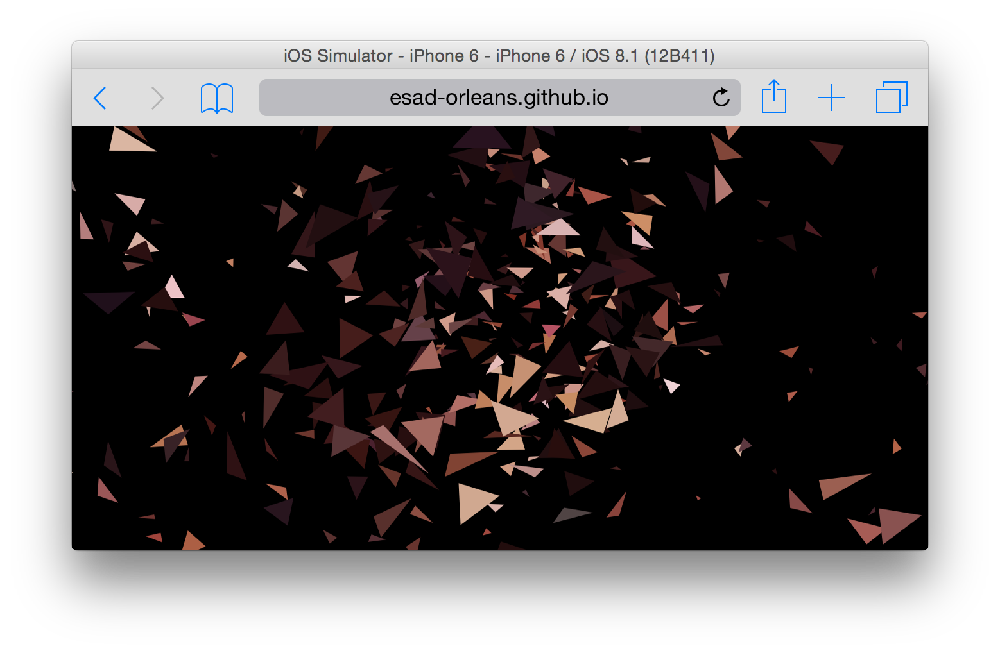

# FaceTime (orleanoïde 2015)
FaceTime est un projet qui a été mené dans le cadre du festival Orléanoïde, dans son édition de 2015.

## fichiers principaux

- le script principal est le fichier [index.js](index.js)
- les données de l'image originale (les triangles) sont dans un fichier `json` [polygons.json](polygons.json)
- ce fichier `json` a été géré à partir d'un fichier `svg`, via le script node [svg2json.js](svg2json.js)

## installation

pour installer le projet en local, il faut avoir installé :

- node js
- bower
- grunt

ensuite pour poursuivre l'installation

- `npm install`
- `grunt init:dev`

tester direcetment sur [esad-orleans.github.io/facetime-orleanoide/](http://esad-orleans.github.io/facetime-orleanoide/)

## Auteur
Chloé Maurand

## Développement
[ESAD Orléans](http://esad-orleans.fr), [Arthur Violy](http://violy.net)